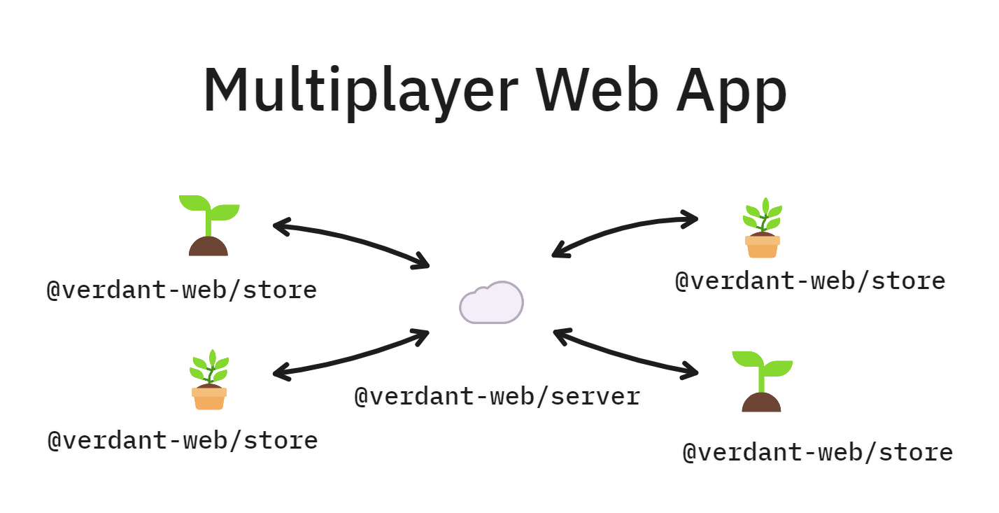

# Verdant 🌿

An IndexedDB-powered database and data sync solution for sustainable, human, local-first web apps.

## [Read the documentation](https://verdant.dev)

> ## Early software!
>
> I'm still rapidly iterating and experimenting with Verdant in my own projects. Be aware that it's not ready for production usage yet and may change significantly in the near future, or include bugs which can cause data inconsistency!

## What does it do?

Verdant is an end-to-end storage and sync framework for web apps. Out of the box, it helps you manage everything you need with local data:

- 🏦 Store everything in IndexedDB across sessions
- 🔎 Query your data using flexible indexes
- ⚡ React to changes instantly and automatically refresh queries
- 🛟 Full type safety based on your schema
- 🧳 Migrate your data model as your app grows and changes
- ⏳ Undo and redo changes
- 🗃️ Store media and files, too

And then, on top of that, it includes an optional server which unlocks the power of sync and realtime:

- ☁️ Back up local data in your own server
- 💢 Robust conflict resolution for offline and real-time changes
- 🛂 Authenticate sync with your app's users
- 👋 Presence for real-time multiplayer
- 🔃 HTTP push/pull or WebSocket syncing, or upgrade on-the-fly

It does it all without any of this\*:

- 📈 Infinitely growing storage usage
- 🤔 Having to deeply understand CRDTs
- 🤝 Peer to peer networking
- 🚄 WASM-compiled databases in your browser

<sub>\* I'm aware most of these are good! But they also add complexity or fundamental changes in model, and the goal of Verdant is to be simple and recognizable.</sub>

# How to use Verdant for your app

Verdant is a versatile framework, made to power a variety of apps. You can start with a basic, local-only app, and progressively add features like device sync and realtime multiplayer as you go.


To start with a local-only app, you only need `@verdant-web/store`, which provides the client-side database and reactive queries. But I _highly_ recommend using `@verdant-web/cli` to set up your client, since this will give you key benefits like TypeScript typings and generated migration files as you iterate on your schema.

You start with an initial data schema, instantiate a client, and then query the documents in your database. All queries are "live" and stay updated in realtime as you add, update, and delete documents. You can even store files inside your documents on the user's device.

As your app evolves, you get the convenience and security of type safety with your schema, but you also get tools to migrate that schema between versions without corrupting your data.

[Read more about creating a schema and generating your client in the docs](https://verdant.dev/docs/category/storing--querying)

You can also find [React bindings to quickly connect a React app to Verdant data](https://verdant.dev/docs/react). If I may say so, Verdant makes React apps quick, easy, and refreshingly fun.


An app that runs and stores data entirely on one device can be useful, but you probably want to sync some data between devices. For this you can set up server-side storage and sync with `@verdant-web/server`. You can run your server anywhere you can set up a Node server and a SQLite database. I use [Fly.io](https://fly.io).

`@verdant-web/server` runs on your server infrastructure; there's no hosted cloud option. You're responsible for authorizing access to sync, user identity, etc. Verdant provides some methods you hook up to endpoints on your server which handle all of the sync and presence features.

[Read more about setting up your server](https://verdant.dev/docs/category/sync)



Once you have a server up and running, it's only one small step to go from device sync to full, realtime multiplayer collaboration. Enable websockets as a transport and everyone who is connected to the same data will benefit from live, conflict-free multiplayer&mdash;plus presence info for connected peers.

Save on socket connections by automatically falling back to HTTP polling when peers leave, or using logic of your choice. Verdant doesn't care what transport is used to sync, it all works out in the end.

[Read more about sync transports](https://verdant.dev/docs/sync/transports)

# Development on Verdant

I'll be the first to admit, this is a labor of love for me, but I never really thought many people would be interested in assisting in building it. I've focused a lot on making Verdant stable for use in my own projects, but not much on making it approachable for other developers.

To set up a development environment, you'll need [pnpm](https://pnpm.io/). I use [Volta](https://volta.sh) to manage tooling, and I recommend installing that so it automatically picks up the right Node version for you.

Run `pnpm i` to install dependencies in all workspaces. That's all you should need to get going.

## Packages

Within `/packages` you'll find the source for each package. Here's an overview:

- `@verdant-web/cli`: A CLI code generator for creating a typed Client out of the user's schema, plus bootstrapping migration files for schema version changes.
- `@verdant-web/common`: A collection of common utilities used on both client and server.
- `@verdant-web/create-app`: A project bootstrapping CLI to create new Verdant projects via `pnpm create @verdant-web/app`.
- `@verdant-web/react`: React hooks for creating and listening to database queries on the client.
- `@verdant-web/react-router`: An experimental, Suspense-based React router that works nicely with Verdant live queries.
- `@verdant-web/server`: The server portion of Verdant, used to sync and store data and enable realtime multiplayer.
- `@verdant-web/store`: The client portion of Verdant, which manages the IndexedDB databases and provides reactive queries and documents.

## Tests

Verdant has several test suites. Whenever I encounter a bug or plan out a big new feature, I've tried to add a test suite which makes sure things work at a high level in `/tests`. That's the source of truth for specifying how Verdant should work for end users.

To run all test suites, run `pnpm test`. To run individual suites in watch mode, run `pnpm test` in the appropriate workspace (`/tests`, or any `/packages/*`).

## How Verdant works

This is too big a topic for a README, but here's the basic idea.

### How data is stored

All data is stored as _baselines_ and _operations_.

A _baseline_ is the starting point for a particular object which all replicas agree on. If no _baseline_ exists, the _baseline_ is implied `undefined`.

An _operation_ is an atomic change to an object, like "set `x` to `2`." Each operation has an ordered, unique 'timestamp' (not actually wall clock time) so they can be deterministically ordered by any replica without negotiation.

To determine the _snapshot_ of any object, you take its _baseline_ and apply all the _operations_ you have related to it, in order.

### How Verdant resolves decentralized changes

A _document_ is a set of arbitrarily nested objects (these objects are often referred to as "entities"). Each object relates to other objects via a _reference_, which is manipulated just like any other field value. Since each object has a unique ID assigned to it, Verdant avoids unwanted and unexpected merge conflicts by tying _operations_ to specific objects by identity, not just their position in the document.

Here's what the objects comprising a _document_ might look like, in abstract:

```
{
  /* ID: foo/1 */
  content: 'Hello world',
  likes: 3,
  comments: { '@@type': 'ref', id: 'foo/1:abcdefg' }
}

[
  /* ID: foo/1:abcdefg */
  { '@@type': 'ref', id: 'foo/1:hijlkmn' },
  { '@@type': 'ref', id: 'foo/1:opqrstu' },
]

{
  /* ID: foo/1:hijlkmn */
  content: 'Nice post',
}

{
  /* ID: foo/1:opqrstu */
  content: 'I make 10k/mo working from home, find out...'
}
```

Imagining one replica inserted a new comment at position 1, and a millisecond after that another replica updated the comment at position 1's content to read "Nice post (edit: really!)". A naive merge without object identities would have overwritten the content of the new comment. In Verdant, this would result in 2 operations: "insert a new object at position 1" and "update the object `foo/1:hijklmn`'s content." Because the operation is tied to the comment's ID, not its position in the document, the change to the content 'follows it' as it moves to position 2 due to the insertion. This is how Verdant avoids some basic problems of conflict resolution.

From there, _operations_ simply apply in last-write-wins fashion, according to their timestamps. I consider this good enough for most usage and haven't found a need for a fancier approach, personally.

### How data is queried

The client stores _baselines_ and _operations_, but these can't be queried because the _snapshot_ is distributed across all of them, conceptually. So the client also computes the _snapshot_ whenever the _operations_ change and stores that in a separate "document database." It's this "document database" which queries are run against.

The client caches queries based on key, so if you make the same exact query in multiple places in your app, they will share a dataset, and the second query executed will immediately return data.

Likewise, all objects (entities) in the client are cached by identity, so changes made to an object in one part of the app are _synchronously_ propagated to all other places that object is used.

### How sync works (in short)

When replicas connect to the server, they send over any operations they've made since they were last online, plus some other metadata.

The server keeps a _server order_ for all operations it sees, which is a monotonically increasing integer. It pulls all the operations with a server order greater than the _acknowledged server order_ it has for that replica and sends them back in response. This should be all operations received since that replica was last online.

The replica finally acknowledges receiving this new set of changes to the server. The server then updates the replica's _acknowledged server order_.

There are a few edge cases. Sometimes a replica has been offline for too long, and the server has decided life must move on without its consensus. If it reconnects, instead of syncing like above, the server will instruct it to reset its local database to what the server sees and discard any unsynced changes.

There's also a case where the _server_ has lost its data and needs a client replica to help it recover. In that case the first client replica to connect will be asked for its version of the database in full, which serves as the new server copy.

Also, when doing websocket-based sync, there are special cases for sending realtime operations as they happen and distributing them to peer replicas as quickly as possible.
